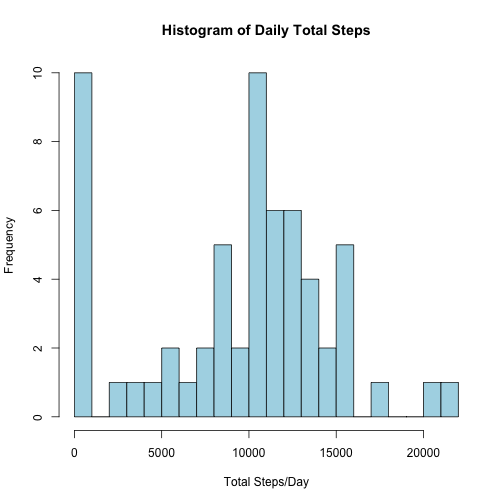
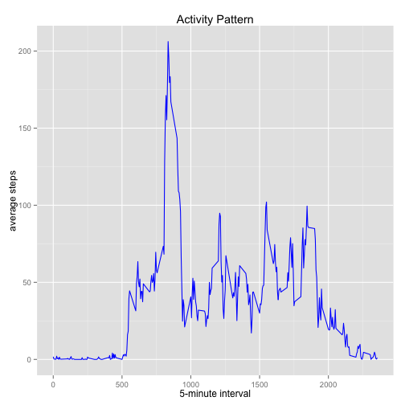
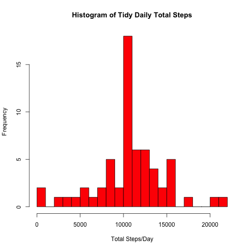
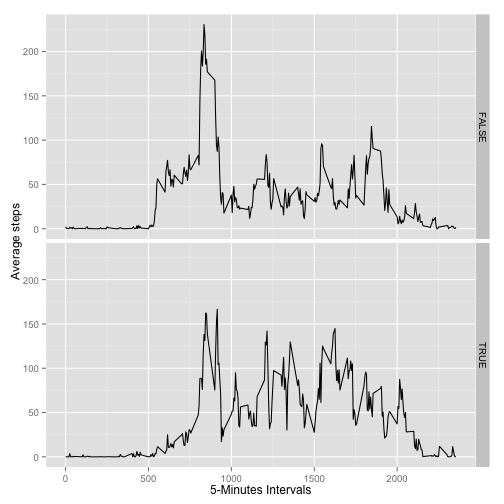

## title: "Physical Activity" - Project 1
## output: html_document
## Created by Bonnie Mohnsen


Load and read data

```r
unzip("activity.zip")
dat <- read.csv("activity.csv", sep = ",", header = T)
```

Include libraries and set up

```r
library(ggplot2)
echo = TRUE
```
What is the total number of steps taken per day?

```r
OrigTotalSteps <- tapply(dat$steps, dat$date, FUN=sum, na.rm=TRUE)
OrigTotalSteps
```

```
## 2012-10-01 2012-10-02 2012-10-03 2012-10-04 2012-10-05 2012-10-06 
##          0        126      11352      12116      13294      15420 
## 2012-10-07 2012-10-08 2012-10-09 2012-10-10 2012-10-11 2012-10-12 
##      11015          0      12811       9900      10304      17382 
## 2012-10-13 2012-10-14 2012-10-15 2012-10-16 2012-10-17 2012-10-18 
##      12426      15098      10139      15084      13452      10056 
## 2012-10-19 2012-10-20 2012-10-21 2012-10-22 2012-10-23 2012-10-24 
##      11829      10395       8821      13460       8918       8355 
## 2012-10-25 2012-10-26 2012-10-27 2012-10-28 2012-10-29 2012-10-30 
##       2492       6778      10119      11458       5018       9819 
## 2012-10-31 2012-11-01 2012-11-02 2012-11-03 2012-11-04 2012-11-05 
##      15414          0      10600      10571          0      10439 
## 2012-11-06 2012-11-07 2012-11-08 2012-11-09 2012-11-10 2012-11-11 
##       8334      12883       3219          0          0      12608 
## 2012-11-12 2012-11-13 2012-11-14 2012-11-15 2012-11-16 2012-11-17 
##      10765       7336          0         41       5441      14339 
## 2012-11-18 2012-11-19 2012-11-20 2012-11-21 2012-11-22 2012-11-23 
##      15110       8841       4472      12787      20427      21194 
## 2012-11-24 2012-11-25 2012-11-26 2012-11-27 2012-11-28 2012-11-29 
##      14478      11834      11162      13646      10183       7047 
## 2012-11-30 
##          0
```
What is mean total number of steps taken per day?

```r
OrigMean <- mean(OrigTotalSteps, na.rm=TRUE)
OrigMean
```

```
## [1] 9354.23
```
What is median total number of steps taken per day?

```r
OrigMedian <- median(OrigTotalSteps, na.rm=TRUE)
OrigMedian
```

```
## [1] 10395
```
Original histogram

```r
hist(OrigTotalSteps, breaks = 30, col = "Lightblue", main = "Histogram of Daily Total Steps", xlab ="Total Steps/Day", ylab = "Frequency")
```

 
What is the average daily activity pattern?

```r
OrigAverage <- aggregate(x=list(steps=dat$steps), by=list(interval=dat$interval), FUN=mean, na.rm=TRUE)
```
Make a time series plot (i.e., type = "1") of the 5-min interval (x) and average step across all days (y-axis)

```r
ggplot(data=OrigAverage, aes(x=interval, y=steps)) + geom_line(color = "blue") + xlab("5-minute interval") + ylab("average steps") + ggtitle("Activity Pattern")
```

 
Which 5-minute interval, on average across all days in the dataset, contains the maximum number of steps?

```r
OrigAverageMaxTime <- OrigAverage[which.max(OrigAverage$steps),]
OrigAverageMaxTime
```

```
##     interval    steps
## 104      835 206.1698
```
Calculate and report, the total number of rows with NAs

```r
NoMissingData <- is.na(dat$steps)
table(NoMissingData)
```

```
## NoMissingData
## FALSE  TRUE 
## 15264  2304
```
Replace missing values using mean for that 5 minute interval to create Tidy Data Set

```r
Tidy <- dat
for (i in 1:nrow(Tidy)) {
     if (is.na(Tidy$steps[i])) {
          Tidy$steps[i] <- OrigAverage[which(Tidy$interval[i] == OrigAverage$interval), ]$steps
}}
```
Tidy  - total number of steps per day

```r
TidyTotalSteps <- tapply(Tidy$steps, Tidy$date, FUN=sum)
TidyTotalSteps
```

```
## 2012-10-01 2012-10-02 2012-10-03 2012-10-04 2012-10-05 2012-10-06 
##   10766.19     126.00   11352.00   12116.00   13294.00   15420.00 
## 2012-10-07 2012-10-08 2012-10-09 2012-10-10 2012-10-11 2012-10-12 
##   11015.00   10766.19   12811.00    9900.00   10304.00   17382.00 
## 2012-10-13 2012-10-14 2012-10-15 2012-10-16 2012-10-17 2012-10-18 
##   12426.00   15098.00   10139.00   15084.00   13452.00   10056.00 
## 2012-10-19 2012-10-20 2012-10-21 2012-10-22 2012-10-23 2012-10-24 
##   11829.00   10395.00    8821.00   13460.00    8918.00    8355.00 
## 2012-10-25 2012-10-26 2012-10-27 2012-10-28 2012-10-29 2012-10-30 
##    2492.00    6778.00   10119.00   11458.00    5018.00    9819.00 
## 2012-10-31 2012-11-01 2012-11-02 2012-11-03 2012-11-04 2012-11-05 
##   15414.00   10766.19   10600.00   10571.00   10766.19   10439.00 
## 2012-11-06 2012-11-07 2012-11-08 2012-11-09 2012-11-10 2012-11-11 
##    8334.00   12883.00    3219.00   10766.19   10766.19   12608.00 
## 2012-11-12 2012-11-13 2012-11-14 2012-11-15 2012-11-16 2012-11-17 
##   10765.00    7336.00   10766.19      41.00    5441.00   14339.00 
## 2012-11-18 2012-11-19 2012-11-20 2012-11-21 2012-11-22 2012-11-23 
##   15110.00    8841.00    4472.00   12787.00   20427.00   21194.00 
## 2012-11-24 2012-11-25 2012-11-26 2012-11-27 2012-11-28 2012-11-29 
##   14478.00   11834.00   11162.00   13646.00   10183.00    7047.00 
## 2012-11-30 
##   10766.19
```
Tidy  -  histogram

```r
hist(TidyTotalSteps, breaks = 30, col = "Red", main = "Histogram of Tidy Daily Total Steps", xlab ="Total Steps/Day", ylab = "Frequency")
```

 
Tidy mean and median

```r
TidyMean <- mean(TidyTotalSteps, na.rm=TRUE)
TidyMean
```

```
## [1] 10766.19
```

```r
TidyMedian <- median(TidyTotalSteps, na.rm=TRUE)
TidyMedian
```

```
## [1] 10766.19
```
Difference between Original mean and Tidy Mean

```r
OrigMean - TidyMean
```

```
## [1] -1411.959
```
Tidy - differences between activity patterns on weekdays and weekends. Create a new factor variable(weekend (TRUE) or weekday)

```r
Tidy$day <- weekdays(as.Date(Tidy$date))
Tidy$Weekend <- with(Tidy, day == "Sunday") | with(Tidy, day == "Saturday")
```
Tidy - Aggregate data by Weekdays (Weekend or Weekday) and Interval

```r
TidyAverage <- aggregate(x=list(steps=Tidy$steps), by=list(interval=Tidy$interval,Tidy$Weekend), FUN=mean)
```
Tidy - Average steps: 0 - weekdays and 1 - weekends


```r
ggplot(TidyAverage, aes(interval, steps)) + geom_line() + facet_grid(Group.2 ~ .) + xlab("5-Minutes Intervals") + ylab("Average steps")
```

 
